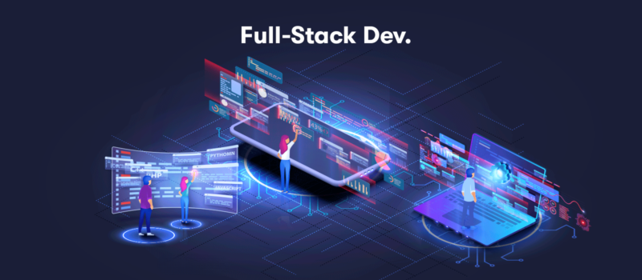

    

    

---

<h1 align="center" style="font-size: 50px; background-color: #333333; color: #f1f1f1; padding: 8px 16px; box-shadow: 0 0 5px;">Salut 👋, je m'appel Alain GUILLON</h1>

<h3 align="center" style="margin: 25px 0 50px">🔥  Passionné par les langages de programmation   🛠️ Construisons l'avenir ensemble</h3>

🎓 Je me forme actuellement sur une formation pour devenir **développeur fullstack** à **l'IT-AKADEMY** sur Lyon. ( _Bac +4_ )

🚀 Je me plonge dans les **technologies de pointe et je nourris ma soif d'apprentissage en développement logiciel. Toujours prêt à dévorer de nouvelles compétences et à évoluer !**

🔍 Je suis à la recherche de **collaborations surprenantes et de développeurs partageant ma passion !**

🙏 J'ai besoin d'un coup de main pour **affiner mon code et explorer de nouvelles technologies. Ouvert à l'apprentissage et à la collaboration avec des magiciens du développement expérimentés !**

💬 Interrogez-moi sur **tout ce qui touche à la programmation, au développement logiciel ou aux tendances technologiques. Je suis là pour partager mes connaissances et discuter dans la bonne humeur !** 

<table style="margin: 50px; width=90%">
    <tr>
        <td valign="top" width="33%" style=" background-color:#333333;">
            <h4 style="text-align:center; color:#f1f1f1">Analyse Github</h4>
            

                
            
 
        </td>
        <td valign="top" width="66%">
            <table>
                <tr>
                    <td valign="top" width="33%">
                        

                            <h4>Frontend</h4>
                            
                             
                             
                        

                    </td>
                    <td valign="top" width="33%">
                        

                            <h4>Backend</h4>
                            
                             
                             
                             
                        

                    </td>
                    <td valign="top" width="33%">
                        

                            <h4>DevOPS</h4>
                            
                             
                             
                             
                        

                    </td>
                </tr>
            </table>
        </td>
    </tr>
</table>

<h3 align="center" style="margin: 50px 0 25px; text-transform: uppercase">🌐 CONNECTEZ-VOUS À MES RÉSEAUX SOCIAUX EN UN CLIC !</h3>

📩 N'hésitez pas à m'envoyer un message, je réponds plus vite que la vitesse de la lumière... enfin ça dépends de mes disponibilités également ! 💨📫

    
    
    
    

<h3 align="center" style="margin: 50px 0; text-transform: uppercase;">Quelques projets</h3>

&nbsp;&nbsp;tp mini casino&nbsp;&nbsp;&nbsp;&nbsp;&nbsp;&nbsp;&nbsp;&nbsp;gestionnaire contact node&nbsp;&nbsp;rn cocktail&nbsp;&nbsp;&nbsp;&nbsp;

<h3 align="center" style="margin: 50px 0; text-transform: uppercase;">Mes statistiques sur github</h3>

&nbsp;&nbsp;

---
---
---

# 💻 Tech Stack:
   

       

 

   

<!--

DART  = 00B4AB
C++   = f34b7d
CS    = 178600
JS    = f1e05a
SHELL = 89e051

 ## 3. Badge des contributeurs
 

-------------------------------

-->